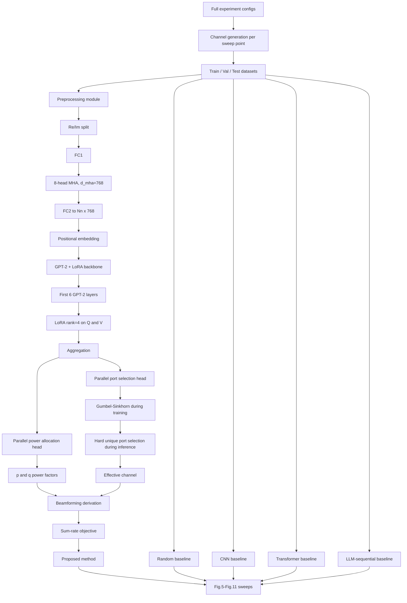

```mermaid
flowchart TD
    A[Full experiment configs] --> B[Channel generation per sweep point]
    B --> C[Train / Val / Test datasets]

    C --> D[Preprocessing module]
    D --> D1[Re/Im split]
    D1 --> D2[FC1]
    D2 --> D3[8-head MHA, d_mha=768]
    D3 --> D4[FC2 to Nn x 768]
    D4 --> D5[Positional embedding]

    D5 --> E[GPT-2 + LoRA backbone]
    E --> E1[First 6 GPT-2 layers]
    E1 --> E2[LoRA rank=4 on Q and V]
    E2 --> F[Aggregation]

    F --> G1[Parallel port selection head]
    F --> G2[Parallel power allocation head]

    G1 --> H1[Gumbel-Sinkhorn during training]
    H1 --> H2[Hard unique port selection during inference]
    G2 --> I[p and q power factors]

    H2 --> J[Effective channel]
    I --> K[Beamforming derivation]
    J --> K
    K --> L[Sum-rate objective]

    L --> M[Proposed method]

    C --> N1[Random baseline]
    C --> N2[CNN baseline]
    C --> N3[Transformer baseline]
    C --> N4[LLM-sequential baseline]

    M --> O[Fig.5-Fig.11 sweeps]
    N1 --> O
    N2 --> O
    N3 --> O
    N4 --> O
```