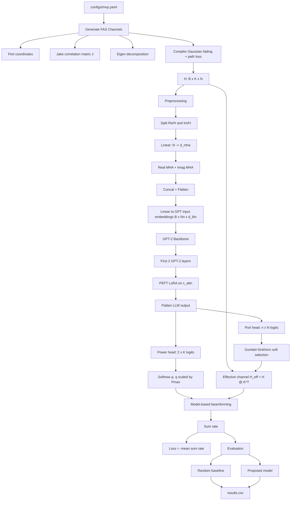

```mermaid
flowchart TD
    A[configs/mvp.yaml] --> B[Generate FAS Channels]
    B --> B1[Port coordinates]
    B --> B2[Jake correlation matrix J]
    B --> B3[Eigen decomposition]
    B --> B4[Complex Gaussian fading + path loss]
    B4 --> C[H: B x K x N]

    C --> D[Preprocessing]
    D --> D1[Split Re/H and Im/H]
    D1 --> D2[Linear: N -> d_mha]
    D2 --> D3[Real MHA + Imag MHA]
    D3 --> D4[Concat + Flatten]
    D4 --> D5[Linear to GPT input embeddings B x Nn x d_llm]

    D5 --> E[GPT-2 Backbone]
    E --> E1[First 2 GPT-2 layers]
    E1 --> E2[PEFT LoRA on c_attn]
    E2 --> F[Flatten LLM output]

    F --> G1[Port head: n x N logits]
    F --> G2[Power head: 2 x K logits]

    G1 --> H1[Gumbel-Sinkhorn soft selection]
    G2 --> H2[Softmax p, q scaled by Pmax]

    C --> I[Effective channel H_eff = H @ A^T]
    H1 --> I
    H2 --> J[Model-based beamforming]
    I --> J

    J --> K[Sum rate]
    K --> L[Loss = -mean sum rate]

    K --> M[Evaluation]
    M --> N1[Random baseline]
    M --> N2[Proposed model]
    N1 --> O[results.csv]
    N2 --> O
```